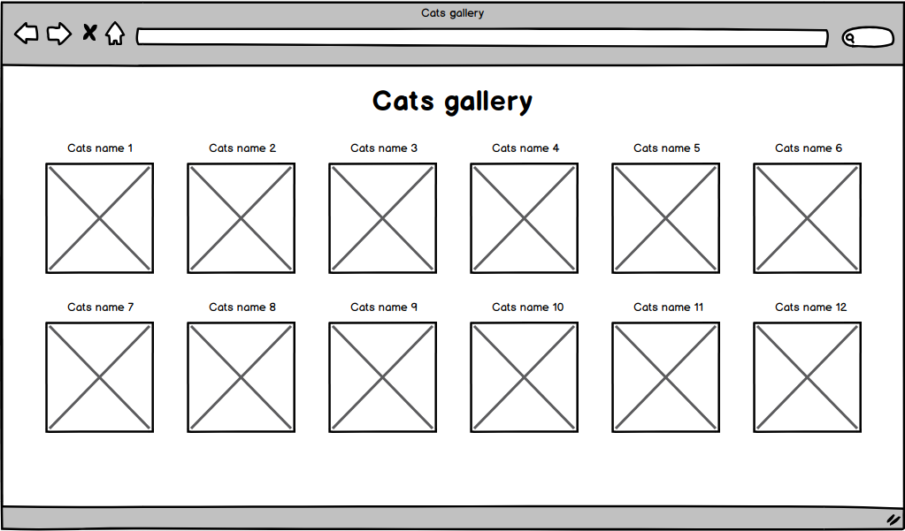
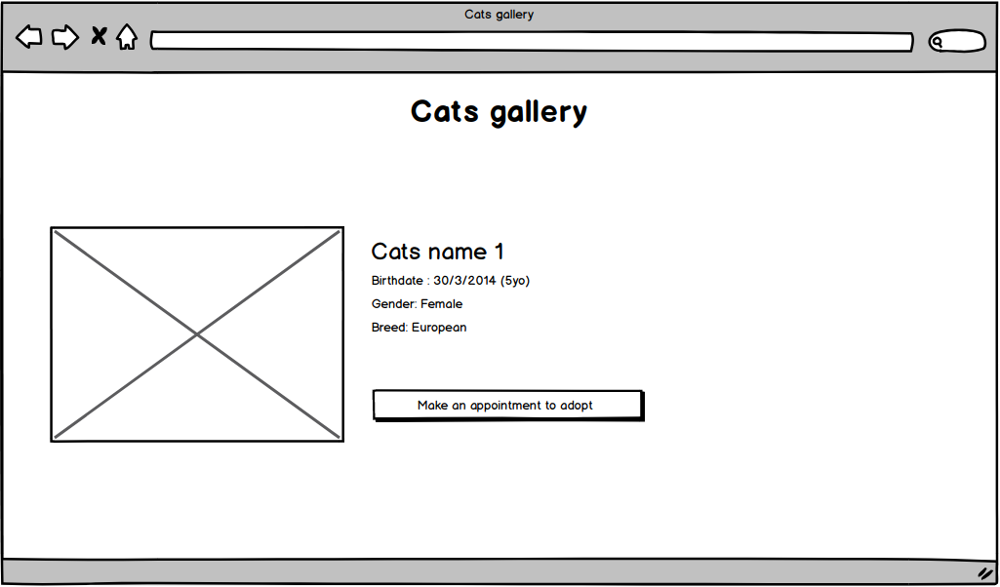

# Cats adoption project (Frontend technical exercise)

## Introduction

You have been proposed this little assignment in order to check how you can address and tackle tasks that have been asked to you. Consider there is no exact answer to the problem nor only one way of doing. The goal of this exercise is to map your strengths and weaknesses. It will allow us to use your code as a discussion support during your technical interview.

## Instructions

### Scenario

A client would like to create a web interface for a feline association. This interface should show cats that needs to be adopted and allows any visitor to make an appointment to adopt a cat.

### Deliverables

- A gallery showing pictures of cats with names.

- When clicking on a cat we can access to details and we should see a button "Make an appointment to adopt"

- When clicking on "Make an appointment to adopt", information of an appointment (date/time) should be displayed to the user.

**Images shown provide an example. Use your own way of doing if you want.**

### Requirements

You must create components to structure your interface. In order to display cats information and retrieve appointment information you will need to consume two different API endpoints :

- http://developers.matters.tech/api/cats to retrieve cats.
- http://developers.matters.tech/api/cat-adoption to make an apppointment and retrieve date information.

Please check http://developers.matters.tech/api-doc for endpoints specifications.

### To go further

If you want to go deeper and improve your cats interface here are some topics you might want to cover :

- Make your grid fully responsive
- Add different kind of tests (integration, ...)
- Improve the provided CI by adding some useful jobs (linting, running extra tests, ...)
- Handle errors
- ...

## Technical helpers

To run the app you must have `node` installed on your computer. `npm` or `yarn` is also mandatory.

### Launch the project with `yarn start` or `npm start`

Runs the app in the development mode. 
Open [http://localhost:3000](http://localhost:3000) to view it in the browser.
The page will reload if you make edits.

### Code linting

By default, you will see any lint errors in the console after project start. 
Feel free to configure your IDE with any eslint plugin in order to visualize linting errors directly in your code.

### Run unit tests with `yarn test` or `npm test`

Launches the test runner in the interactive watch mode.
